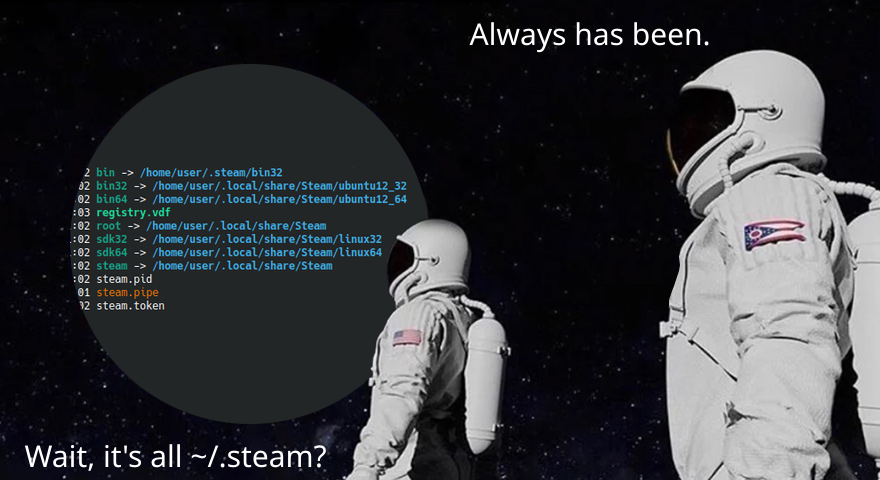

# steam_xdg_enforcer

Born shortly after the 10th anniversary of ValveSoftware/steam-for-linux#1890, this program allows to rewrite the paths accessed by Steam into proper ones by using [FUSE](https://www.kernel.org/doc/html/latest/filesystems/fuse.html).

This also opens up the possibility to finally create proper packages, while getting rid of the insane bootstrapping process.

## Rationale

### `~/.steam`

The infamous path is hardcoded in the `steam` binary. The relevant code is pretty much as follows:

```c
char path[FILENAME_MAX];
snprintf(path, sizeof(path), "%s/%s", getenv("HOME"), ".steam");
```

And at least [one script](ValveSoftware/steam-for-linux#9345) is also affected.

You may've noticed that, in most cases, the installation actually lives at another location:

```
lrwxrwxrwx 1 user user  23 Apr 22 01:02 bin -> /home/user/.steam/bin32
lrwxrwxrwx 1 user user  41 Apr 22 01:02 bin32 -> /home/user/.local/share/Steam/ubuntu12_32
lrwxrwxrwx 1 user user  41 Apr 22 01:02 bin64 -> /home/user/.local/share/Steam/ubuntu12_64
-rwxrwxr-x 1 user user 305 Apr 22 01:03 registry.vdf
lrwxrwxrwx 1 user user  29 Apr 22 01:02 root -> /home/user/.local/share/Steam
lrwxrwxrwx 1 user user  37 Apr 22 01:02 sdk32 -> /home/user/.local/share/Steam/linux32
lrwxrwxrwx 1 user user  37 Apr 22 01:02 sdk64 -> /home/user/.local/share/Steam/linux64
lrwxrwxrwx 1 user user  29 Apr 22 01:02 steam -> /home/user/.local/share/Steam
-rw-rw-r-- 1 user user   6 Apr 22 01:02 steam.pid
prw------- 1 user user   0 Apr 22 01:01 steam.pipe
-r-------- 1 user user  16 Apr 22 01:02 steam.token
```

Basically, the undesired directory is still around strictly for compatibility with legacy installations.

<details> 
<summary>Image</summary>


</details>

### Installation scope

Valve publish their own Debian/Ubuntu package, which is then picked up and polished by various distributions.

However, it doesn't contain anything more than a bootstrapper called `steam`.

This program allows you to achieve a system-wide installation, 

## Example launch script

```sh
export STEAM_INSTALL_DIR="/usr/libexec/steam"
export STEAM_DATA_DIR="${HOME}/.local/share/steam"
export STEAM_RUN_DIR="${XDG_RUNTIME_DIR}/steam"

MOUNT_POINT="${STEAM_RUN_DIR}/.steam"

mkdir -p "${MOUNT_POINT}" "${STEAM_DATA_DIR}"

./steam_xdg_enforcer "${MOUNT_POINT}"

pushd .

cd "${STEAM_INSTALL_DIR}"

ORIG_HOME="${HOME}"
ORIG_LD_LIBRARY_PATH="${LD_LIBRARY_PATH}"

export HOME="${STEAM_RUN_DIR}"
export LD_LIBRARY_PATH="${STEAM_INSTALL_DIR}/ubuntu12_32:${STEAM_INSTALL_DIR}/ubuntu12_32/panorama:${LD_LIBRARY_PATH-}"

ubuntu12_32/steam -noverifyfiles -nobootstrapupdate -skipinitialbootstrap -norepairfiles -nodircheck -inhibitbootstrap

export LD_LIBRARY_PATH="${ORIG_LD_LIBRARY_PATH}"
export HOME="${ORIG_HOME}"

umount "${MOUNT_POINT}"

popd
```

Useful generic reference: https://wiki.fex-emu.com/index.php/Steam
